<div align="center">


# SchemaField

**The architecture of input.**

Build structured forms in minutes, share them with a link or QR code, and analyze responses as they arrive.
Self-hosted, typed end to end, and yours to run.

[](LICENSE)
[](https://www.djangoproject.com/)
[](https://react.dev/)
[](https://vitejs.dev/)
[](#-quick-start)

[Features](#-features) ·
[Screenshots](#-a-tour-of-schemafield) ·
[Quick start](#-quick-start) ·
[Configuration](#%EF%B8%8F-configuration) ·
[Deployment](#-deploying-to-production) ·
[API](#-api-reference)

<br />

<picture>
  <source media="(prefers-color-scheme: dark)" srcset="docs/screenshots/dashboard-dark.png" />
  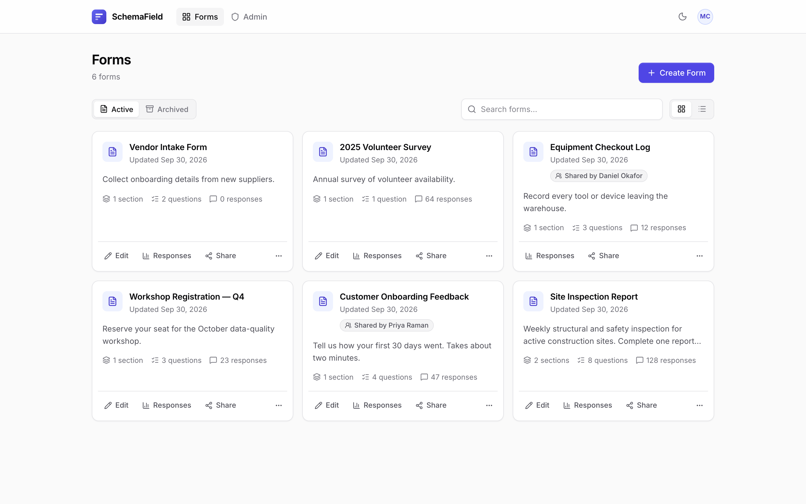
</picture>

</div>

---

## ✨ Features

<table>
<tr>
<td width="33%" valign="top">

### 🧱 Schema-first builder
Sections, ordered questions and seven typed fields: short text, long text, integer, decimal, multiple choice, multiple select and media upload. Attach images, video or audio to any question.

</td>
<td width="33%" valign="top">

### 🔗 Share anywhere
Every form gets an unguessable public link and a print-ready QR code. Respondents don't need an account. Set a deadline and the form closes itself.

</td>
<td width="33%" valign="top">

### 📊 Live analytics
Daily or weekly trends, per-question breakdowns, top answers and keywords. Stack up to 20 answer filters to slice the whole response history.

</td>
</tr>
<tr>
<td valign="top">

### 🧾 Spreadsheet view
Sort any column across the full history, including exact ordering for large integers and decimals. Stream everything to a spreadsheet-safe CSV.

</td>
<td valign="top">

### 👥 Collaboration
Give teammates `edit` or `view_responses` access per form. Archiving is per user, so tidying your dashboard never hides a form from a colleague.

</td>
<td valign="top">

### 🛡️ Built to be hosted
JWT auth with revocation on password change, rate-limited endpoints, allow-listed upload types, unguessable file names, and an admin console for users and storage.

</td>
</tr>
</table>

Light and dark themes are included throughout, and every page works on mobile.

---

## 📸 A tour of SchemaField

### Build

Design forms as structured schemas: sections, typed questions, required flags, attached media and an optional submission deadline. Export any form as a JSON template and import it elsewhere.

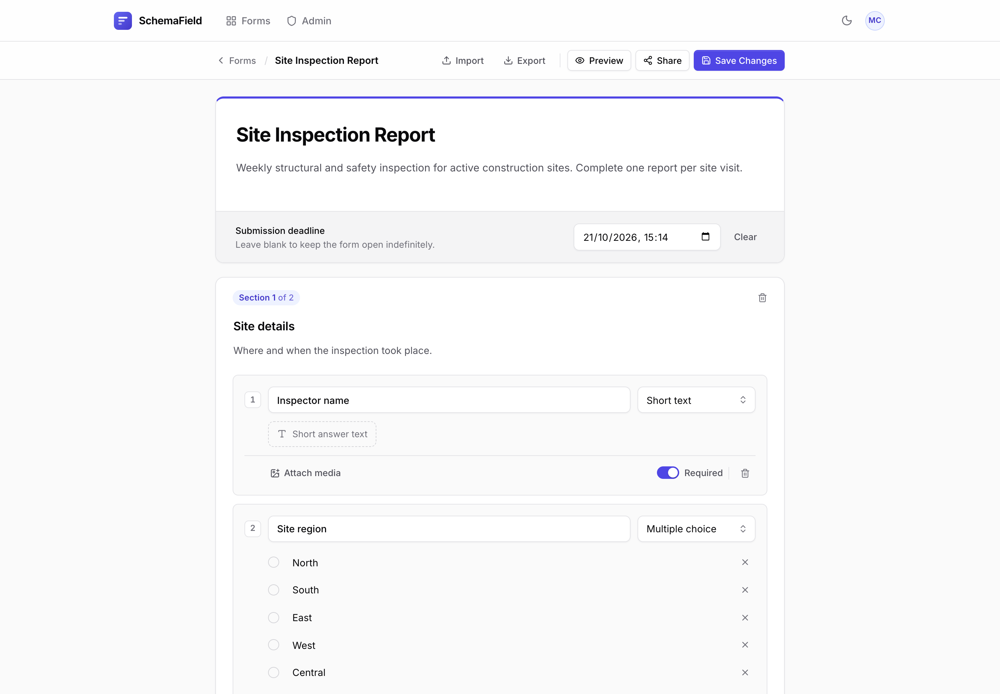

### Share

One click gives you a public link and a downloadable QR code, ready for a poster, a clipboard or a job-site wall.

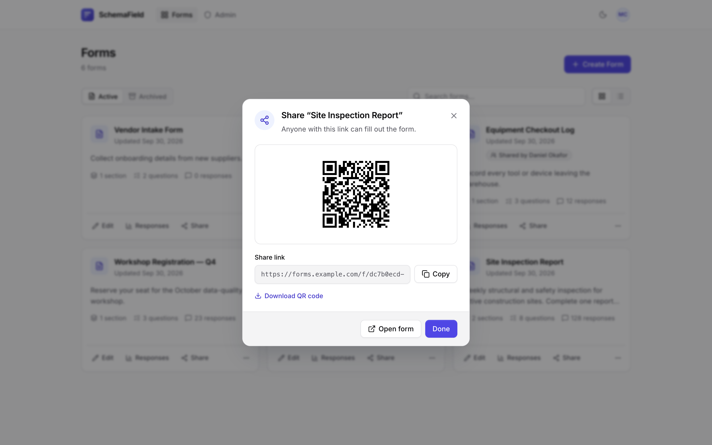

### Collect

Respondents get a clean, focused form on any device, with no sign-up required. Required fields, deadlines and upload limits are enforced on the server.

<table>
<tr>
<td width="68%">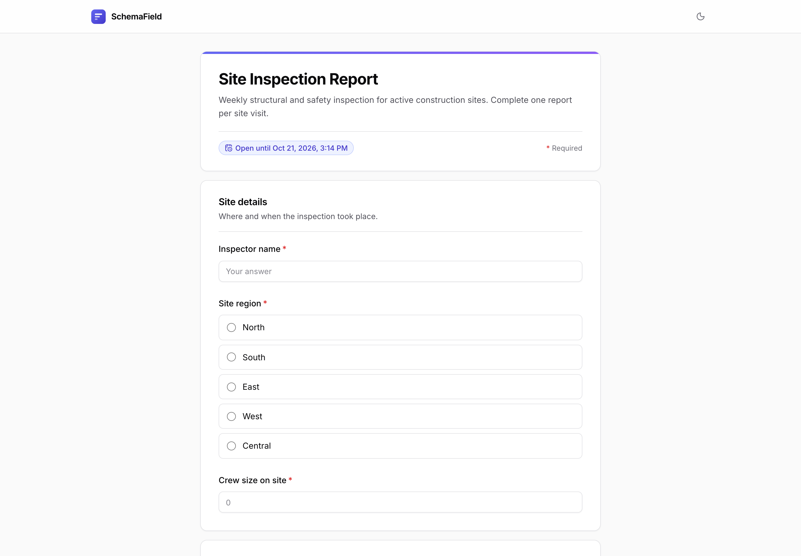</td>
<td width="32%">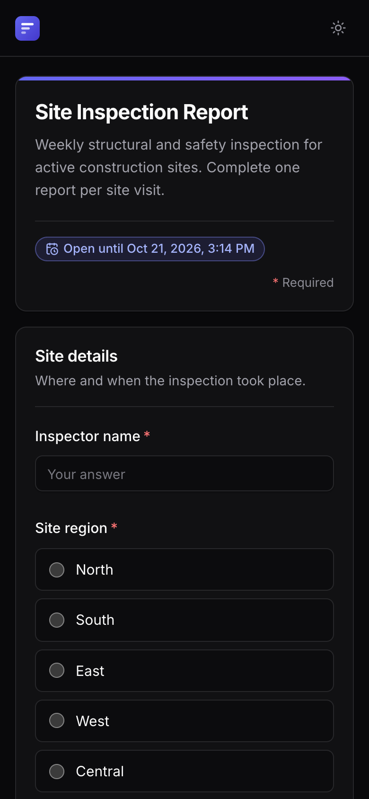</td>
</tr>
</table>

### Analyze

See how responses arrive over time, then drill into every question. Filters apply to the entire history, not just the page you're looking at.

<picture>
  <source media="(prefers-color-scheme: dark)" srcset="docs/screenshots/analytics-dark.png" />
  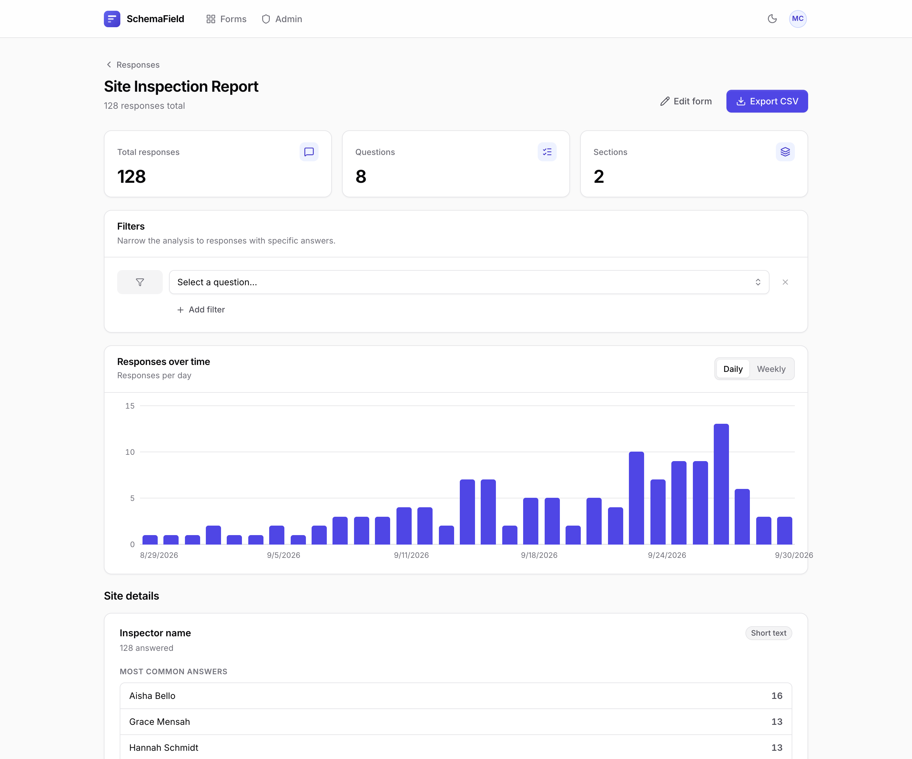
</picture>

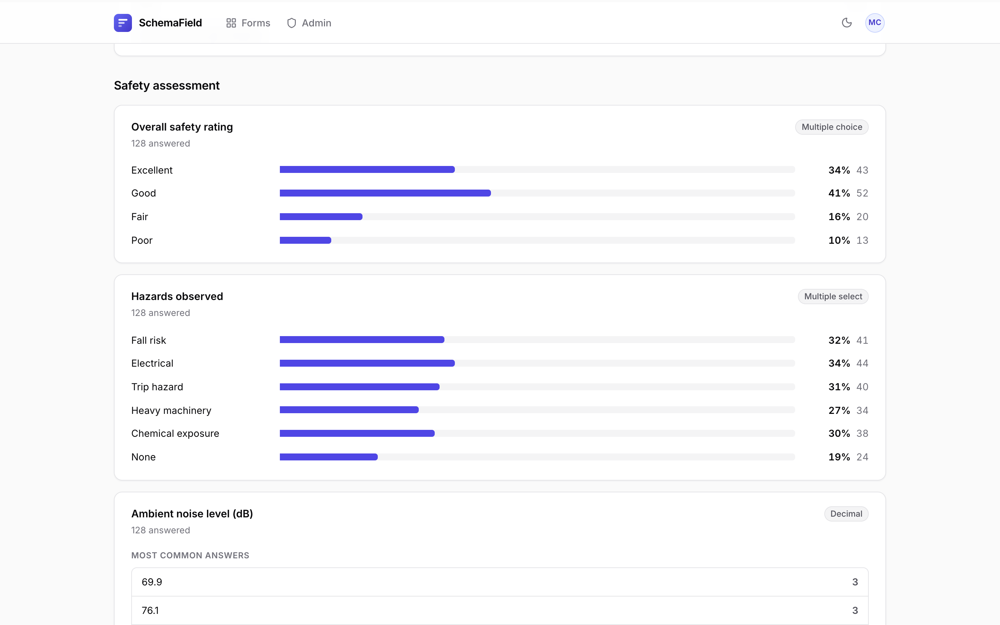

### Review

Read summaries or step through individual submissions, or switch to the spreadsheet to scan, sort and export.

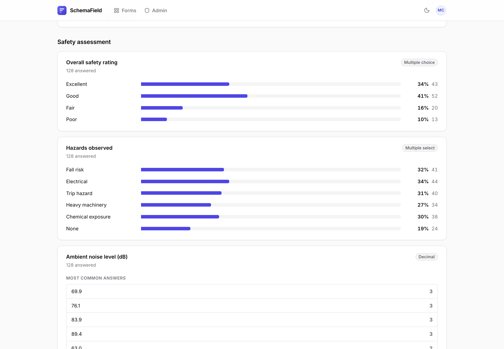

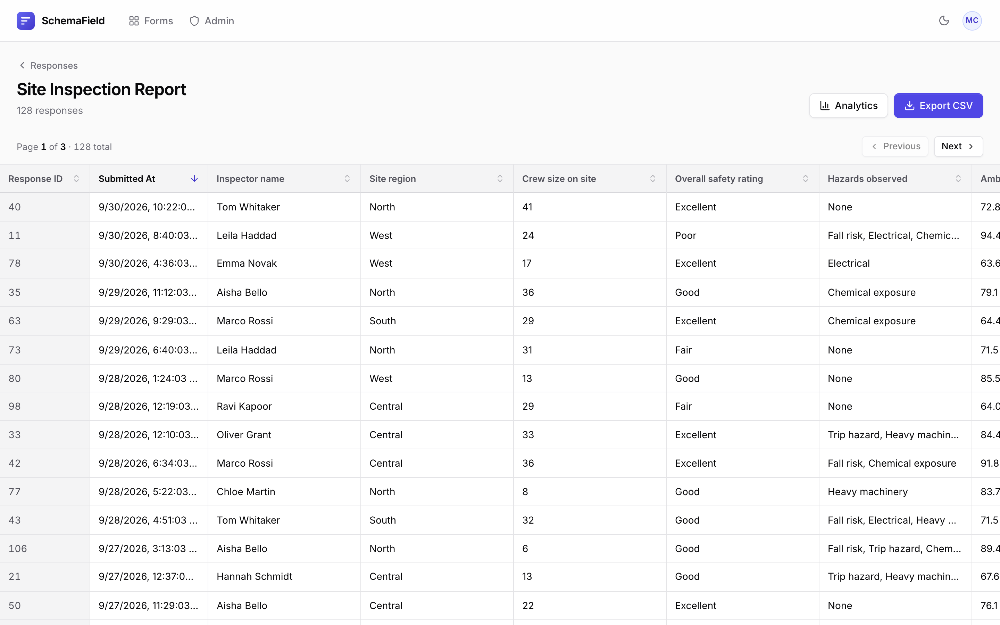

### Administer

Admins manage accounts, reset passwords, browse uploaded files and clean up orphaned storage.

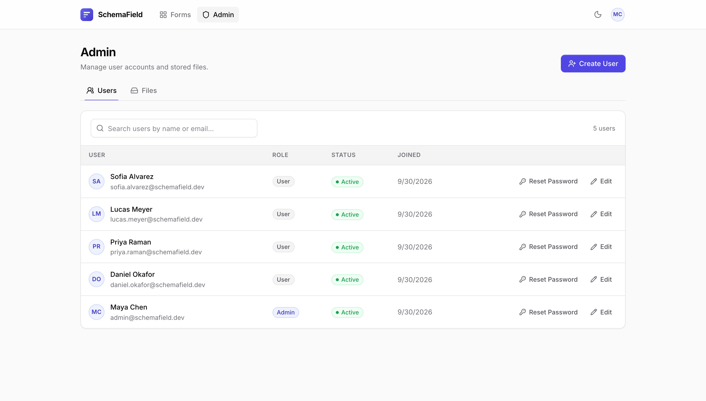

---

## 🚀 Quick start

### With Docker (recommended)

You need [Docker](https://docs.docker.com/get-docker/) with Compose.

```bash
git clone https://github.com/jaggerjack61/SchemaField.git
cd SchemaField
docker compose up --build
```

| Service | URL |
|---|---|
| Web app | http://localhost:5173 |
| API | http://localhost:8000/api/ |
| Health check | http://localhost:8000/health |

Then create your first admin account:

```bash
docker compose exec backend python manage.py createsuperuser
```

Sign in at http://localhost:5173/login and click **Create Form**.

<details>
<summary><b>More Docker commands</b></summary>

```bash
docker compose down        # stop
docker compose down -v     # stop and wipe the database volume
```

To create an admin automatically on startup, set `DJANGO_SUPERUSER_EMAIL`, `DJANGO_SUPERUSER_NAME` and `DJANGO_SUPERUSER_PASSWORD` on the `backend` service.

Under Compose, SQLite lives in the named volume `backend_data` at `/data/db.sqlite3`, not in `backend/db.sqlite3` on your host. This keeps the bind-mounted source tree from sharing a host database.

</details>

### Without Docker

**Requirements:** Python 3.8–3.12 (the Docker image uses 3.11) and Node.js 20.19+.

**1. Backend (Django)**

```bash
cd backend
python -m venv .venv
source .venv/bin/activate          # Windows: .venv\Scripts\activate
pip install -r requirements.txt
python manage.py migrate
python manage.py seed_admin --email you@example.com   # prints a generated password once
DEBUG=True python manage.py runserver                  # http://127.0.0.1:8000
```

> [!NOTE]
> `DEBUG` defaults to `False`, which turns on HTTPS redirects and stops Django serving `/media/`. Set `DEBUG=True` for local development.

**2. Frontend (React + Vite)**

```bash
cd frontend
cp .env.example .env               # optional: change VITE_PROXY_TARGET
npm install
npm run dev                        # http://localhost:5173
```

The Vite dev server proxies `/api` and `/media` to the backend, so no CORS setup is needed locally.

---

## ⚙️ Configuration

All configuration is through environment variables.

### Backend

| Variable | Default | Description |
|---|---|---|
| `DJANGO_SECRET_KEY` | *random per process* | **Required in production.** Without it, sessions are invalidated on every restart. |
| `DEBUG` | `False` | Development mode. When `False`, HTTPS redirect, HSTS, secure cookies and `X-Frame-Options: DENY` are enabled. |
| `DJANGO_ALLOWED_HOSTS` | `localhost,127.0.0.1,[::1],testserver` | Comma-separated host names Django will serve. |
| `CORS_ALLOWED_ORIGINS` | `http://localhost:5173,http://127.0.0.1:5173` | Comma-separated origins allowed to call the API from another domain. |
| `CORS_ALLOW_ALL_ORIGINS` | `False` | Allow any origin. Not recommended outside development. |
| `SQLITE_PATH` | `backend/db.sqlite3` | Location of the SQLite database file. |
| `FRONTEND_BASE_URL` | `http://localhost:5173` | Public URL of the web app, encoded into each form's QR code. After changing it, run `python manage.py regenerate_qr_codes --all`. |
| `DJANGO_NUM_PROXIES` | `0` | Number of trusted reverse proxies. Rate limits key on client IP, so set this to your proxy count to read `X-Forwarded-For` correctly without allowing spoofing. |
| `SEED_ADMIN_PASSWORD` | — | Password used by `seed_admin` when `--password` is not given. |
| `DJANGO_SUPERUSER_EMAIL` / `_NAME` / `_PASSWORD` | — | Docker only: creates this admin on container start if it doesn't exist. |

### Frontend

| Variable | Default | Description |
|---|---|---|
| `VITE_PROXY_TARGET` | `http://127.0.0.1:8000` | Backend the Vite dev server forwards `/api` and `/media` to. |

### Built-in limits

| Limit | Value |
|---|---|
| Access token lifetime | 30 minutes, refreshed automatically |
| Refresh token lifetime | 7 days |
| Login attempts | 5 per minute per IP |
| Public submissions | 60 per hour per IP |
| Media uploads | 30 per minute per user, 10 MB per file |
| Files per submission | 25 MB in total |
| Orphaned-upload grace period | 24 hours (`ORPHAN_UPLOAD_GRACE_SECONDS`) |

Accepted media types are JPEG, PNG, GIF, WebP, HEIC/HEIF, MP4, WebM, Ogg, MOV, MP3, WAV, M4A and AAC. Both the declared MIME type and the file extension must be on the allow-list.

---

## 🌐 Deploying to production

The included Compose file is for development: it runs Django's `runserver` and the Vite dev server. For production:

1. **Build the frontend.** `cd frontend && npm ci && npm run build` produces a static site in `frontend/dist/`.
2. **Run Django under a WSGI server**, for example `gunicorn backend.wsgi`, with `DEBUG=False`, a strong `DJANGO_SECRET_KEY`, and `DJANGO_ALLOWED_HOSTS` set to your domain.
3. **Put a reverse proxy in front** that serves `dist/`, forwards `/api/` to Django, and serves `/media/` from `backend/media/`. Django does not serve media when `DEBUG=False`.
4. **Set `FRONTEND_BASE_URL`** to your public URL so QR codes point to the right place, and set `DJANGO_NUM_PROXIES=1` when behind a single proxy.
5. **Terminate TLS** at the proxy. With `DEBUG=False`, Django redirects HTTP to HTTPS and sends HSTS headers.
6. **Back up** the SQLite file (`SQLITE_PATH`) and the `media/` directory.

<details>
<summary><b>Example nginx server block</b></summary>

```nginx
server {
    listen 443 ssl http2;
    server_name forms.example.com;

    # ssl_certificate / ssl_certificate_key ...

    client_max_body_size 30m;
    root /srv/schemafield/frontend/dist;

    location /api/ {
        proxy_pass http://127.0.0.1:8000;
        proxy_set_header Host $host;
        proxy_set_header X-Forwarded-For $proxy_add_x_forwarded_for;
        proxy_set_header X-Forwarded-Proto $scheme;
    }

    location /media/ {
        alias /srv/schemafield/backend/media/;
    }

    location / {
        try_files $uri /index.html;
    }
}
```

Because nginx terminates TLS here, also tell Django to trust the forwarded protocol, for example by adding `SECURE_PROXY_SSL_HEADER = ('HTTP_X_FORWARDED_PROTO', 'https')` to your settings. Otherwise the HTTPS redirect will loop.

</details>

> [!IMPORTANT]
> `/media/` is public by design so respondents' uploads can be displayed without an auth header. New uploads are stored under random names; run `python manage.py rename_answer_uploads` once if you have uploads from before migration `0007`.

---

## 🏗️ Architecture

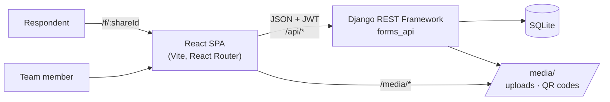

| Layer | Technology |
|---|---|
| Frontend | React 18, React Router 6, Axios, Lucide icons, plain CSS with design tokens |
| Backend | Django 4.2, Django REST Framework, Simple JWT, django-cors-headers |
| Storage | SQLite, local filesystem for media and QR codes |
| Tooling | Vite 5, Vitest, Testing Library, Docker Compose |

<details>
<summary><b>Project structure</b></summary>

```
SchemaField/
├── backend/
│   ├── backend/              # Django project: settings, URLs, WSGI/ASGI
│   ├── forms_api/
│   │   ├── models.py         # Form, Section, Question, Choice, Response, Answer, permissions
│   │   ├── views.py          # REST endpoints, throttling, file manager
│   │   ├── serializers.py    # Nested form schema (de)serialization and validation
│   │   ├── response_queries.py  # Filtering, sorting and analytics queries
│   │   ├── csv_utils.py      # Streaming, spreadsheet-safe CSV export
│   │   ├── upload_validation.py # Content-based media type checks
│   │   ├── management/commands/ # seed_admin, regenerate_qr_codes, rename_answer_uploads
│   │   └── tests.py
│   └── Dockerfile
├── frontend/
│   ├── src/
│   │   ├── pages/            # Dashboard, FormBuilder, FormAnalytics, FormSpreadsheet, Admin…
│   │   ├── components/       # Navbar, ShareModal, QuestionCard, ResponseSummary…
│   │   ├── contexts/         # Auth and theme providers
│   │   ├── styles/           # Tokens, base, component and page styles
│   │   └── api.js            # Axios client with token refresh
│   └── Dockerfile
├── docs/screenshots/
└── docker-compose.yml
```

</details>

---

## 🔌 API reference

All endpoints are under `/api/` and require `Authorization: Bearer <access token>` unless marked public.

<details>
<summary><b>Authentication</b></summary>

| Method | Endpoint | Description |
|---|---|---|
| `POST` | `/api/auth/login/` | Exchange email and password for an access/refresh token pair (public) |
| `POST` | `/api/auth/token/refresh/` | Get a new access token (public) |
| `GET` | `/api/auth/me/` | Current user |
| `PATCH` | `/api/auth/me/` | Update your name |
| `POST` | `/api/auth/change-password/` | Change password; signs out other sessions and returns a new token pair |

</details>

<details>
<summary><b>Forms and responses</b></summary>

| Method | Endpoint | Description |
|---|---|---|
| `GET` `POST` | `/api/forms/` | List or create forms. List accepts `search`, `archived` (`true`/`false`), `page`, `page_size` (≤ 100) |
| `GET` `PUT` `PATCH` `DELETE` | `/api/forms/{id}/` | Read or modify a form with its nested sections, questions and choices |
| `GET` | `/api/forms/by-share-id/{share_id}/` | Fetch a form for respondents (public) |
| `POST` | `/api/forms/by-share-id/{share_id}/submit/` | Submit a response (public, rate-limited) |
| `GET` | `/api/forms/{id}/responses/` | Paginated, filterable, sortable responses |
| `GET` | `/api/forms/{id}/analytics/` | Summaries and daily/weekly trends |
| `GET` | `/api/forms/{id}/export_csv/` | Streaming CSV export; `timezone` (IANA) sets the timestamp zone, default UTC |
| `POST` | `/api/forms/{id}/archive/` | Archive for the current user |
| `POST` | `/api/forms/{id}/restore/` | Restore from archive |
| — | `/api/permissions/` | Grant or revoke per-form `edit` / `view_responses` access |
| `POST` | `/api/upload-question-media/` | Upload media to attach to a question |

</details>

<details>
<summary><b>Administration (admin role only)</b></summary>

| Method | Endpoint | Description |
|---|---|---|
| — | `/api/users/` | User CRUD; `?search=` filters by name or email |
| `POST` | `/api/users/{id}/reset_password/` | Reset a user's password |
| `GET` | `/api/users/file-manager/summary/` | Storage usage summary |
| `GET` | `/api/users/file-manager/browser/` | Paginated media browser |
| `DELETE` | `/api/users/file-manager/file/?path=` | Delete a managed file |
| `GET` | `/api/users/file-manager/cleanup-preview/` | List orphaned files |
| `POST` | `/api/users/file-manager/cleanup-orphaned-files/` | Delete orphaned files |
| `GET` | `/health` | Health check (public, outside `/api/`) |

</details>

<details>
<summary><b>Filtering, sorting and analytics parameters</b></summary>

Response lists, analytics and CSV exports accept a `filters` query parameter: a JSON list of up to 20 answer filters, combined with AND. Each filter has a `questionId` plus one of:

- `textQuery`: substring match on text answers
- `choiceId`: responses that selected this choice
- `mediaMode`: `with_file` or `without_file`
- `numericOperator` and `numericValue`: numeric comparison

```http
GET /api/forms/1/responses/?filters=[{"questionId":4,"choiceId":17}]&sort=submittedAt&direction=desc
```

- **Responses** also accept `page`, `page_size` (≤ 100), `sort` (`submittedAt`, `id` or a question ID) and `direction` (`asc`/`desc`). Sorting runs over the full history before pagination.
- **Analytics** accepts `trend` (`daily`/`weekly`), an IANA `timezone`, and `keywords=1` for keyword counts on text questions. Summaries cover all matching responses and include at most five text or file previews per question.
- **CSV exports** quote every field and prefix formula-like text with a tab so spreadsheets don't execute it. Validated numbers keep their original spelling. The protective tab stays in the data if you import the CSV programmatically.

</details>

---

## 🧭 Frontend routes

<details>
<summary><b>All routes</b></summary>

| Route | Page | Access |
|---|---|---|
| `/` | Landing page | Public |
| `/login` | Sign in | Public |
| `/f/:shareId` | Public form | Public |
| `/dashboard` | Forms dashboard | Signed in |
| `/profile` | Profile and password | Signed in |
| `/forms/new` | Form builder | Signed in |
| `/forms/:id/edit` | Form builder | Signed in |
| `/forms/:id/preview` | Form preview | Signed in |
| `/forms/:id/view` | Form view by internal ID | Signed in |
| `/forms/:id/responses` | Response summary and individual responses | Signed in |
| `/forms/:id/responses/spreadsheet` | Spreadsheet view | Signed in |
| `/forms/:id/responses/analytics` | Analytics | Signed in |
| `/admin` | Admin console | Admin |
| `/admin/users` | User management | Admin |
| `/admin/files` | File management | Admin |

</details>

---

## 🧰 Management commands

| Command | Description |
|---|---|
| `python manage.py seed_admin [--email …] [--name …] [--password …]` | Create an admin. Without a password (or `SEED_ADMIN_PASSWORD`) it generates one and prints it once. |
| `python manage.py regenerate_qr_codes [--all]` | Regenerate missing QR codes, or every QR code with `--all`. |
| `python manage.py rename_answer_uploads [--dry-run]` | Rename uploads stored under their original file names (before migration `0007`) to unguessable names. |

On Windows, `backend/p.bat` wraps common tasks: `p` runs the server, `p <port>` runs it on a port, `-a` activates the venv, `-m` migrates, `-m -r` resets the database and migrates, `-cs` creates a superuser, and `-c` runs checks.

---

## 📐 Data integrity

- **Answered questions keep their type.** Changing a question's type after it has responses is rejected, so historical data is never reinterpreted. Add a new question instead.
- **Questions with responses can't be deleted** from a form, so every stored answer stays attached to the question it answered.
- **Orphan cleanup is conservative.** Files modified in the last 24 hours are skipped so editors can finish saving, and database references are rechecked before anything is deleted. If an unsaved upload was already removed, saving the form asks you to upload it again.
- **Password changes revoke sessions.** Tokens carry a hash of the password, so changing or resetting it signs out every existing session.

---

## 🧪 Testing

```bash
# Backend
cd backend && python manage.py test

# Frontend
cd frontend && npm test
```

---

## 🤝 Contributing

Issues and pull requests are welcome. For larger changes, please open an issue first to discuss the approach. Before submitting, make sure both test suites pass.

---

## 📄 License

SchemaField is released under the [MIT License](LICENSE).
